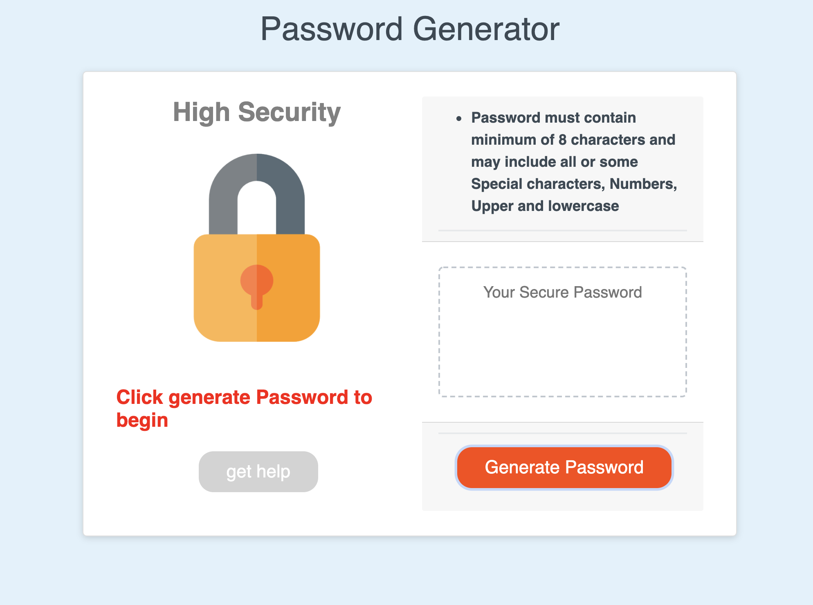

# highSecurity
password generator app

## Function of this unique App
A high security App which generates random strong password by merging criteria chosen by the user. 
* Click [Password generator](https://stefan-aikins.github.io/highSecurity/) to checkout the app.

### App Preview

## Usage
* begin by clicking generate password button
* Enter number of characters for the password and click ok to proceed. 
Cancelling will not end the process but no password will be genrated at the end. 
* An alert will caution you when you enter a number below 8 or above 128 but the generator will produce a new at the end password.
* Confirm which character to include in the password, cancelling will not include that specific character.
* NB: cancelling all characters will lead to no password generated at the end.
* Repeat the same process to generate new strong password. 
* Once a new password is generated, the previous is cleared from the textarea.
* Get help when you face challenges generating a new password, simply click the get help button and fill the contact me form. The team will respond to you as soon as possible.

## Credits
* Responsive interface is supported by  [Bootstrap](https://getbootstrap.com/)
* Lock icon was sourced from  [flat icons](https://www.flaticon.com/)

## Future upgrade
* The app will not proceed when no character is chosen.
* No password will be generated when user enters characters below 8 or above 128
